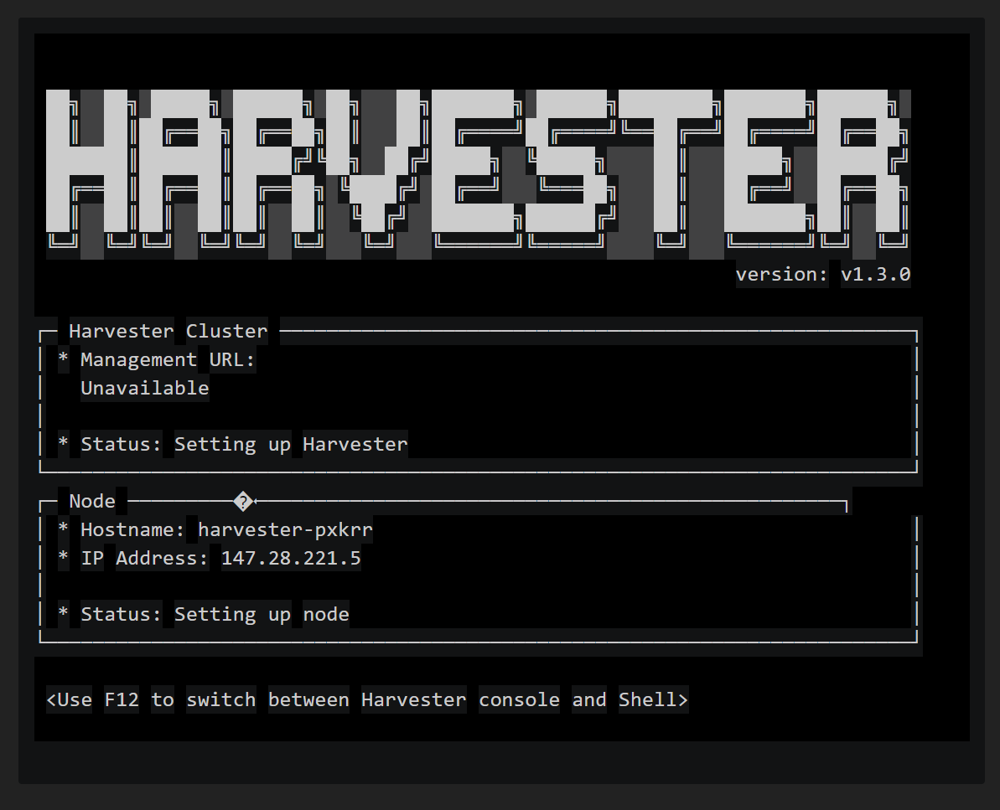

# Pré-requis

* Un compte Equinix metal.

* Un projet Equinix + une clé ssh déposée dedans, pour avoir a minima un accès console.

# Point d'attention !

Le point sensible de l'installation c'est la config cloud-init, surtout la partie réseaux. Parce-que tout bêtement les noms d'interfaces ne sont pas les mêmes selon les machines Equinix.

L'exemple ici tourne: 
 - sur zone Dublin
 - machine m3.small.x86

Si vous changer de machine voire de zone vous devrez probablement changer le userdata cloud init...

# Création machine 
Menu Bare Metal Servers -> Deploy -> Deploy on Demand.

Choisissez la zone (Metro) de Dublin.

Dans la section "Choose Your Operating System": 
* choisissez "custom_ipxe"
* mettez `https://raw.githubusercontent.com/jseguillon/ipxe-examples/main/equinix/ipxe-install` comme valeur

Dans la section Optional Settings:
* Public IPv4 -> laissez activé sinon pas de boot ipxe ni download iso sur github (car pas d'accès Internet héhé)
* User data -> copier le contenu de `userdata-create.yaml` en remplaçant les `<champs à configurer>`

Cliquez sur "Deploy now, surveillez la création de la VM, dès que c'est prêt cliquez sur l'instance, puis sur le bouton "out-of-band" (le symbole de shell `>_`) pour avoir un accès à la console.

Il va y avoir plein de download, de décompression et la sortie est horrible:

... mais on peut (hélas) se connecter en ssh... en utilisant le couple login/mdp `rancher/rancher`... oooooppps notre serveur est exposé, prêt à se faire hacker :'( Et non le champs password qu'on a mis dans notre userdata bah il s'applique pas au premier boot ipxe + iso... le mieux c'est surement de ... bah faire en airgap ou rebuild l'iso.... 

Bon au bout d'un moment (la dernière extraction d'archive est un peu longue) le serveur reboot et l'install Harvester démarre pour de bon. Et si on perd le ssh, on garde l'accès console même pendant le reboot c'est toujours ça de pris.

Dès que le menu d'install Harvester s'afficheappuyez sur F12 et tapez le mot de passe qui sert enfin à qq chose... et hop on est root.

Aussi cette fois en ssh les clés sont appliquées, et on peut se logger proprement. Mieux que le F12 sans doute. 

Bref, donc par le F12 ou le ssh, on prend le root, et on surveille à coup de `kubectl get pods -A -w`:

Quand ça bouge plus trop avec le kubectl, on peut se connecter sur l'IP publique du serveur.

Et là paf c'est à nouveau le drame, on peut créer un mot de passe mais encore une fois ya pas de sécurité, si un gus se pointe il peut mettre ce qu'il veut ... Ok c'est moins grave on peut le reset dans les Secrets via ssh mais quand même...

# Le cas où ça se passe mal

Le premier boot, en ipxe, devrait bien se passer. Mais si vous vous êtes loupés sur la partie réseau du user data, ça se passera pas bien à l'install. 

Pour vérifier: un coup de `ip -br a`. Si aucune interface n'a d'IP, corriger la config en mettant au moins une interface existante dans le bonding comme indiqué [dans la doc](https://docs.harvesterhci.io/v1.3/install/update-harvester-configuration#bonding-slaves)

# La fin pour le moment

Va falloir faire mieux au niveau sécurité quand même :/ 
